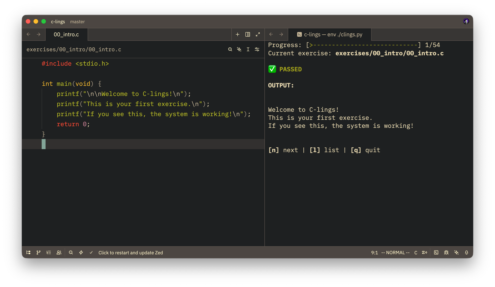

# C-lings

Small C exercises to get you used to reading and writing C code, inspired by [Rustlings](https://github.com/rust-lang/rustlings) 🦀.

<p align="center">
    
</p>

## Recommended Resource

For a comprehensive and friendly guide to C, I recommend **[Beej's Guide to C Programming](https://beej.us/guide/bgc/)**.

It covers everything from basics to pointers and memory management in a very readable style.

## Setup

1. Clone this repo.

2. Make sure you have a C compiler installed (GCC or Clang).
   - On macOS/Linux, `cc` is usually available.
   - On Windows, you might need MinGW or WSL.

3. Run the runner:
   ```bash
   ./clings.py
   ```

## How to use

The script will guide you through the exercises in order.

1.  It will try to compile and run the current exercise.
2.  If it fails, read the error output.
3.  Open the file (e.g., `exercises/01_variables/variables1.c`) in your editor.

4.  Fix the code.
5.  The compiler will try to compile and run your code again.

Tips:

- You should open the termial in a vertical split for the fastest feedback loop.
- You can generally **Ctrl/Cmd + Click** to open the file in your editor.

## Lesson Summary

| Lesson | Topic               | What You'll Learn                                                        |
| ------ | ------------------- | ------------------------------------------------------------------------ |
| 00     | intro               | Entry points, return types, and C comment rules.                         |
| 01     | variables           | Declaration, initialization, and const correctness.                      |
| 02     | types               | Overflow, casting, signed/unsigned pitfalls, and promotions.             |
| 03     | fixed-width ints    | Portable integer types and limit macros.                                 |
| 04     | string literals     | Printing and assigning string literals safely.                           |
| 05     | input parsing       | Safe line reads with fgets and number parsing with sscanf.               |
| 06     | simple structs      | Defining structs and accessing members.                                  |
| 07     | enums & typedefs    | Enum usage and typedef for structs.                                      |
| 08     | control flow        | Switch fallthrough fixes and loop scoping.                               |
| 09     | error handling      | errno/strerror diagnostics and return codes.                             |
| 10     | functions           | Prototypes and pass-by-value vs reference patterns.                      |
| 11     | pointers            | Address-of, dereference, and const pointer qualifiers.                   |
| 12     | pointer structs     | Dot vs arrow operators with struct pointers.                             |
| 13     | arrays              | Decay, bounds, checked access, and VLA parameters.                       |
| 14     | pointer arithmetic  | Pointer increment and distance calculations.                             |
| 15     | string manipulation | Terminators, safe string APIs, and buffer sizing.                        |
| 16     | malloc/free         | Heap allocation, leaks, and calloc vs malloc.                            |
| 17     | realloc             | Resizing patterns and flexible array members.                            |
| 18     | memory layout       | offsetof, padding math, and struct layout.                               |
| 19     | double pointers     | Allocating for callers and 2D arrays.                                    |
| 20     | command line args   | argc/argv basics.                                                        |
| 21     | macros              | Precedence, side effects, do-while, stringify, token pasting, variadics. |
| 22     | preprocessor        | Conditional compilation and include guards.                              |
| 23     | files               | fopen errors and binary/text IO.                                         |
| 24     | unions & bitfields  | Union memory sharing and bitmasking.                                     |
| 25     | linkage             | static, extern, and static local persistence.                            |
| 26     | function pointers   | Callbacks, qsort, and void\* patterns.                                   |
| 27     | variadic functions  | Building a variadic sum function.                                        |
| 28     | undefined behavior  | Dangling pointers, use-after-free, and shift UB.                         |

## Progress

Your progress is saved in `.c-lings-state.txt`. To reset, just delete that file.

## License

MIT License.

## Related Projects

- [C-init](https://github.com/a-hariti/c-init): A tool to initialize a C project with everything you need to hit the ground running.
